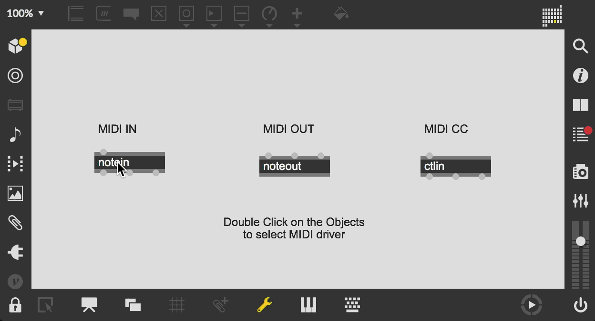
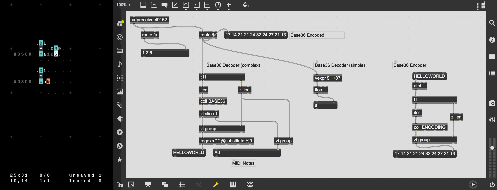

# MaxMSP Aufbau ORCA
The German word "Aufbau" is here primarily understood as a process of establishing interoperational constitution between Max/MSP and other programming languages. This constitutional process is realized through three interpretations of Aufbau. In this part we will examine MaxMSP Aufbau of ORCA.

## Set-up

### MIDI

MIDI is the only one of the three communication protocols that is bidirectional meaning that ORCA can both send and receive messages from Max/MSP. in order to communicate through MIDI we must make sure that both ORCA and Max/MSP are using the same MIDI Driver in this case I am using the IAC Driver Bus 1.

In this first example ORCA is sending MIDI information to Max/MSP. This information can be send on different MIDI channels in ORCA "0" is a MIDI Channel "1" in Max/MSP using the object "notein 1" will receive the note pitch value and velocity.

In this second example ORCA is receiving MIDI information from Max/MSP. Using the Kslider keyboard in conjunction with the "noteout 1" object in Max/MSP, ORCA is receiving the notational values. This functionality is also available across multiple Midi Channels.

By default ORCA sets the Control number of MIDIcc to 64, in order to set this to 1, the users must use cmd + k or ctrl + k in order to activate the ORCA commandpromt. To change the Control number the user should type in "CC:1" in the promt. In this final example ORCA is sending MIDIcc to Max/MSP. Max receives these values through the "ctlin" object, which can also receive values from multiple MIDI-channels.

### OSC

By default ORCA has an OSC port 49162, this port is assigned to the Max object "udpreceive" from here I am using the "route" object to get the data from either address /a or /b. On /a I am sending numerical values with one of the numbers changing randomly. On /b I am sending the message "HelloWorld".

When I was exploring the ways of sending OSC messages between Max/MSP and ORCA I found that sending number values were very easy in comparison to sending strings of words. All letters would be received as encoded Base36, which meant that "HelloWorld" would be recieved in Max as "17 14 21 21 24 32 24 27 21 13". Thanks to Italo Lombardo and Rajan Craveri I was able to assemble two ways of decoding the Base36 message. I have marked these as simple and complex decoders aswell as an encoder for the Base36.

| **0** | **1** | **2** | **3** | **4** | **5** | **6** | **7** | **8** | **9** | **A** | **B** |
| ----- | ----- | ----- | ----- | ----- | ----- | ----- | ----- | ----- | ----- | ----- | ----- |
| 0     | 1     | 2     | 3     | 4     | 5     | 6     | 7     | 8     | 9     | 10    | 11    |
| **C** | **D** | **E** | **F** | **G** | **H** | **I** | **J** | **K** | **L** | **M** | **N** |
| 12    | 13    | 14    | 15    | 16    | 17    | 18    | 19    | 20    | 21    | 22    | 23    |
| **O** | **P** | **Q** | **R** | **S** | **T** | **U** | **V** | **W** | **X** | **Y** | **Z** |
| 24    | 25    | 26    | 27    | 28    | 29    | 30    | 31    | 32    | 33    | 34    | 35    |

### UDP

By default ORCA has an UDP port 49161, in order to receive the raw UDP message in Max the UDP port should be assigned to the Max Object "mxi net.udp.recv" as an attribute "@port 49161".

## Structure

Max/MSP with ORCA share as lot of communication protocols which means that there is a lot of different ways of establishing a connection between the two programs. ORCA has three protocols which can be used for communication  MIDI,OSC and UDP. All of the protocols can be used for sending out values to Max/MSP, however only MIDI can also receive notational values. This means that the only bidrectional communication possible is through MIDI, this is worth considering when composing using this setup.

## Compose

### Sources

- 