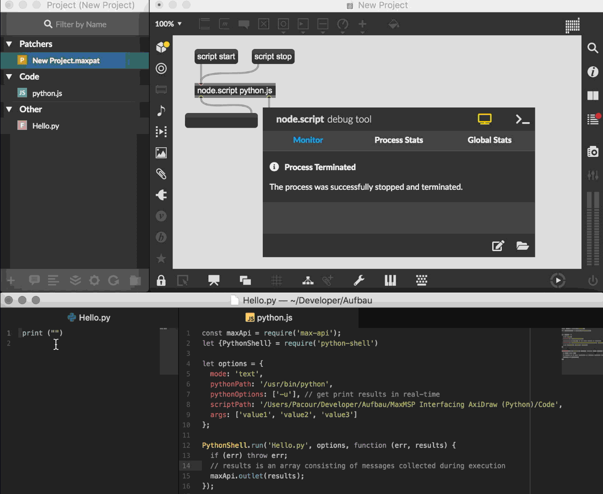

# MaxMSP Interfacing AxiDraw (Python)
The word "Interfacing" is here primarily understood as a process of establishing interoperational constitution between Max/MSP and other programming languages. In this part we will examine the interfacing between Max/MSP and an AxiDraw XY plotter through Python.


## Set-up

In this guide I assume that the reader has already worked with AxiDraw through the inkscape software, and is familiar with using it to plot .svg. Thus we wont be covering all of the necessary first time quick setup which is covered extensivly throughout this [guide](https://cdn.evilmadscientist.com/dl/ad/public/AxiDraw_Guide_v40_r3.pdf)

On page 17 of the guide, the reader will have come accross "3.3 Aside: Alternative software, CLI, and API's". in this section, it becomes apparent to the user of the AxiDraw that there are other ways of controlling the plotter than using inkscape.

There is a stand-alone command-line interface (CLI) tool, as well as a full-featured python library. You can learn more about these tools at:

[CLI](https://axidraw.com/doc/cli_api/#introduction)

[Python](https://axidraw.com/doc/py_api/#introduction)

In this guide we will mainly be focusing on using the python library to control the AxiDraw, and try to combine the python library with Max/MSP.

[Download](https://cdn.evilmadscientist.com/dl/ad/public/AxiDraw_API.zip) and unzip this folder on your computer.

In the unzipped folder there is another named "AxiDraw_API_v256" where the rest of the elements are located for using python with Axidraw.

### Installing the Python-AxiDraw-Api

- Install [Python](https://www.python.org/downloads/ ) on your computer if you don't already have it available. This can be checked by typing in "python --version" into your Terminal or CMD.
- You will also need to have Pip installed which is Pythons package manager. Again you can check if you already have this on your computer by typing "pip --version" into your terminal or CMD.
  - if pip is not installed you can type in "sudo easy_install pip" into your terminal or CMD. This will install pip on your computer

### Installing dependencies 

- Use pip to install pyaxidraw og axicli
  - in Terminal or CMD write
    "cd /Users/username/Documents/axidraw-api/  (Your location and path will vary)"
  - write "pip install"
  - write "pip install -r requirements.txt"

#### Python interactive

open /AxiDraw_API_v256/test_Interactive.py in a text-editor that can run python-scripts. in this guide I will be using ATOM.

```python
from pyaxidraw import axidraw   # import module
ad = axidraw.AxiDraw()          # Initialize class
ad.interactive()                # Enter interactive context
ad.connect()                    # Open serial port to AxiDraw
                                # Absolute moves follow:
ad.moveto(1,4)                  # Pen-up move to (1 inch, 1 inch)
ad.lineto(2,1)                  # Pen-down move, to (2 inch, 1 inch)
ad.moveto(0,0)                  # Pen-up move, back to origin.
ad.disconnect()                 # Close serial port to AxiDraw
```


Connect your computer and power-cable to the plotter and compile the python script.

If you have installed and connected everything correctly then you should see the plotter move. If not go back and check that everything has been done according to the installation guide.

The question is now, how can we connect the Python script to Max/MSP in a way that makes sense?

In order to establish a connection between max/MSP and python we need to use the Node for max framework and an npm package called [python-shell](https://www.npmjs.com/package/python-shell) which can be installed by writing "npm install python-shell" in the terminal or CMD

then we must create two files a Hello.py, and a javascript file containing the necessary code to establish a connection we will call this python.js.

Hello.py contains

```python
print("Hello World from Python!")
```

python.js contains

```js
const maxApi = require('max-api');
let {PythonShell} = require('python-shell')

let options = {
  mode: 'text',
  pythonPath: '/usr/bin/python', //insert your path to python here
  pythonOptions: ['-u'], // get print results in real-time
  scriptPath: '/Users/Pacour/Developer/Aufbau/MaxMSP Interfacing AxiDraw (Python)/Code', //insert your path to Hello.py here
  args: ['value1', 'value2', 'value3']
};

PythonShell.run('Hello.py', options, function (err, results) {
  if (err) throw err;
  // results is an array consisting of messages collected during execution
  maxApi.outlet(results);
});
```

Now that the files are done we can move on to the max-patcher. 

- make a new patcher, and save it as a project within the folder where the other .js and .py scripts are located.




## Structure


## Compose


### Sources
- https://wiki.evilmadscientist.com/AxiDraw_User_Guide

- https://www.youtube.com/watch?v=WQbY0JkJnU0

- https://www.npmjs.com/package/python-shell

- https://docs.cycling74.com/nodeformax/api/module-max-api.html#.DictIdentifier

  

