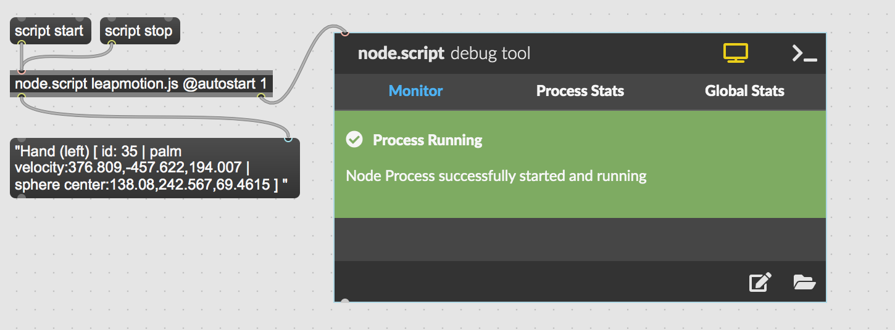

# Max/MSP interfacing with Leap Motion (Node for Max)

## minimum requirements to connect Leap Motion with Max/MSP
in order to connect leap motion controller with Max/MSP we are going to use Node for Max with the cylon-leapmotion npm package

First you will have to make sure that node.js is installed on your system. Next up you have to initialize an npm project. This is done by "cd" to the correct directory using the terminal/CMD then you want to type in "npm init" and go through the setup.

in order to enable the cylon-leapmotion package you just have to follow their guide, or just type in "npm i cylon-leapmotion". After all of this has downloaded you are ready to setup the Node for Max environment.

create a Max-patch with the node.script object and name the .js file that you want to use for the leap motion input. save you patch as a max project and open it up in a text editor of your choice. I have used atom for this project. now create the .js file that you linked with you node.script object in max. (here it is a good idea to refresh the node.script object in max).

Now in order to get all of that cool data from the Leap Motion write this code in the .js file

```javascript
const maxApi = require('max-api');

var Cylon = require('cylon');

Cylon.robot({
  connections: {
    leapmotion: { adaptor: 'leapmotion' }
  },

  devices: {
    leapmotion: { driver: 'leapmotion' }
  },

  work: function(my) {
    my.leapmotion.on('hand', function(payload) {
      maxApi.outlet(payload.toString());
    });
  }
}).start();
```

run the code by enabling the the node.script object in max/msp and connect a message-box through the "cold" input, so that you can see all of the data.



<details>
  <summary>Max/MSP Patch</summary>
    <pre><code>
----------begin_max5_patcher----------
882.3ocyW0zbaBCD8L9WgFcpcFBwBP.NmZu0oSyLcldrMiGYPMVY3qQR33zO
9uWoEvwokfMwoM8fkMh05su2tZ0puOyAupZKWgQWf9Lxw46ybbforS3z8rCt
fsMMmo.yvoUEE7RM1s8cZ9VMLeM068eBsQnZX4huwkndKpY5z0hxqWJ4o5Vj
BiW3M2EQlaGWDYG8M+FcU2eoroPTly0.hjtIEY.NUqt4rfX78VV0n6Mctcxe
Nalcv8H4SI+VyR9mzQxq4kYnFY9gIRDPgH3299SgHg8K9WqJ0JitAFZVhA4W
+JzNk9tZdqafw6PztNkrB3E32JErb7SPTt4V9piI9E4QcQAKRfuBWrGykFwi
KKpx.OY9QpG993QIdZUdkr0GHfGr+vNrGQdrgSKXq05Z0EmeddXZUiz6Zgdc
yJOQ04Wx1d4m93YefypurRKpJO+oneEbkhcM+OxplBrGT9Chg7sv3wS67GHs
K.O47qmQUPxyqXYiPPJcgMipcaUXBvufIvO+4CtsJ3kda0uIHCvbxBJDZoPR
Mc9jCsjjWhP6PLIL3DYR7+Dl7H0+klkmi1htaLJFGBrh.4oT53TLX.JRGlhA
OJEc697rte7K32wLG08Jo3505WavQjYhH9DzOP0r7BzFy90Tg9tKNKI12iFQ
cIAQy8hotAQTuvEQFCU0q4RNJ0zZ.WdwYAQdjHZDXP.k5FS8n9QwnqPeA2ie
tnjaJCVBNQ3HxLj6PHTaMA+.PlilRlTxKZ0NUpTTqQJcU8H4RIvtERLT2iN4
MK9+mvQlTiOXjL99h6Sqhf+KYEgRSuLdcDM2bNcAbNs2MJzaXM5Jf6HxAYeD
oslQvjaVjLL68GsXwtUWw1vyVZVGi+rjo0RwJSENUmNzIDN3cTYOmvAmw+JW
tWibNfZrbknbognqAWDu6U0EOxat0JJ6ZTuMtzGc.GEpI7aWGATR67OLjoLM
Pk1S09lZP2qlYbkVTxrwn8MJr0nASKNZjBOBjrsxdxHYaj4eCR1ihPjCfjs4
BqQmNRGhS1C+OcjNFfdn2TIyZSzI+0QN4AB9NfmeZILIGCmeNxW7eR.0tKmU
WugKUcFCXXJAeS6U6RbgGEksOB0fLWYXin2dn6HLSZpupMEyZjsckuMp8xzX
6kNkkMhtvngcFHgx61N3U0rVh.mBL6my9E.VEWud
-----------end_max5_patcher-----------
</code></pre>
</details>


## source
- https://www.npmjs.com/package/cylon-leapmotion
- https://github.com/fiebrink1/wekinator_examples/tree/master/inputs/LeapMotion/LeapMotionViaProcessing/LeapMotion_Fingertips_15Inputs
- http://jklabs.net/maxlink/index.html%3Fpage=about.html
