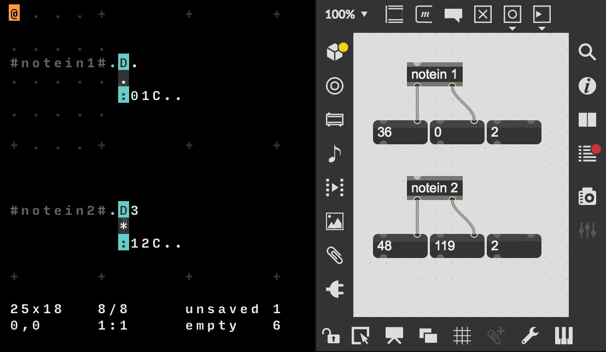
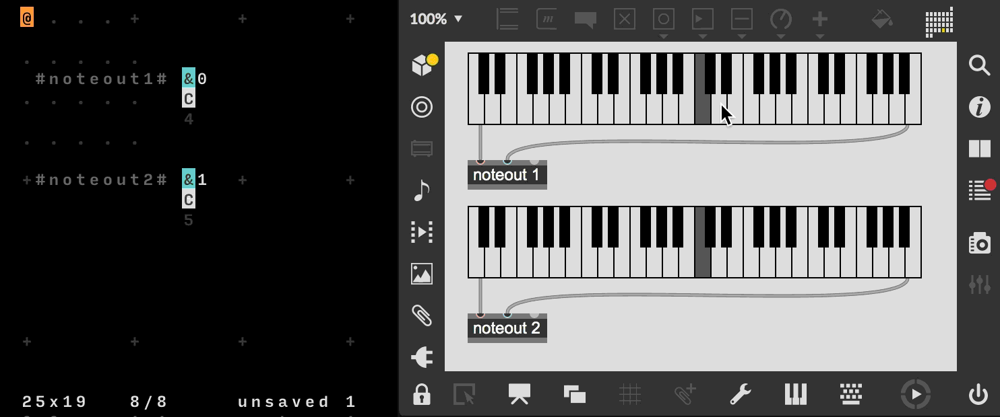
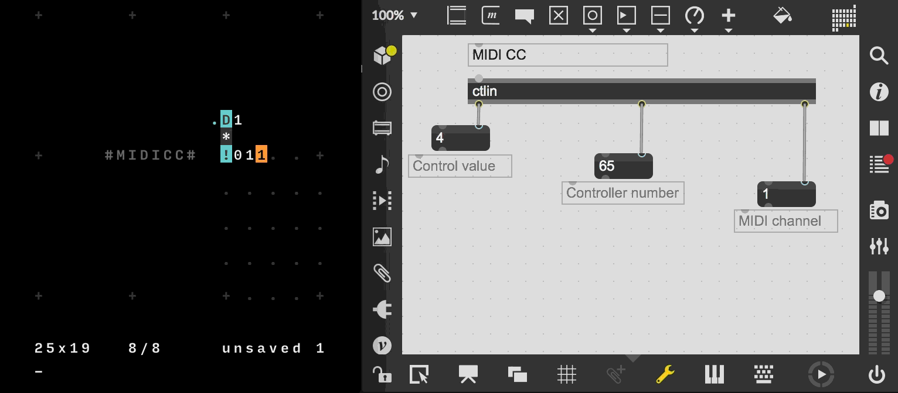
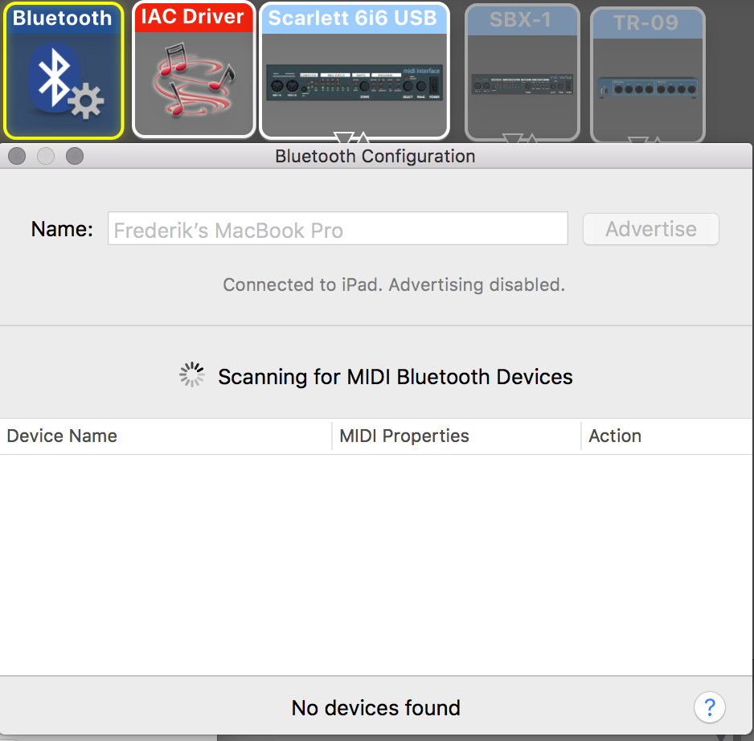
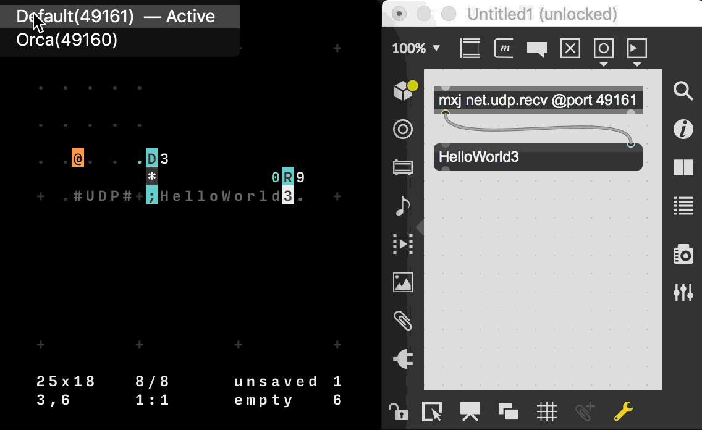

# MaxMSP Interfacing ORCA
The word "Interfacing" is here primarily understood as a process of establishing interoperational constitution between Max/MSP and other programming languages.

## Set-up

### ORCA x Max/MSP Template.

  
ORCA

.........
.........
..D2.....
..*......
..:04C...
.........
.........

  
Max/MSP

<pre><code>
----------begin_max5_patcher----------
687.3ocyVssihCCC841uBTeFPMkVJy9qrZDJT7.YTZBJIkEzH1u8M2JWC2Fp
FsOzzFGWe7wwwNeEGkLiuAjI89Uue2KJ5q3nHqHifH+7njZ7lJJVZUKgRVCC
WfIr+lz2s7ZrfgqgqrJYtcA9rOGflzJbEVUsjvVLU.UJG5n2Fl1uGZzHyq27
SJGl16c++vZpILJnrtQlWn1szVByX.sh2vr1J8vOvaTs+QgWpSjZ6Jvgahjr
fgoI8O9KyyGTNVY9fRjZ699dWWnIqBDSAFdF0ZEjeMIdMLeJVoDjYMJ3vWRe
.0GQMwLZCv+nUbq7iMeqK5oyIq0vHJoZqC87.JTqiUl0FTlNLjAnb1hquoch
pDMVDL8R5dFfXaVy3fv4sgKhO.k0FMOQI4RtPExobptKN9vK63t39OXRaEut
FzYG98IErQ4jujMbeNo.jZcvJBmMkRXv9Dpr.oxk2JUdrMIdRoYbTlYLK8ZY
xnfYqocHIWCzPGFGeCFL4HBjM9mh.0fThW.WP.TH2O+Va.E4FetnvNlZ8+r6
UJ4T+GcsxE5JAcH0RCQsQ2fZkn+yXFC9i1oufXywUgZATd2N.YSPG5.7rbKs
6HP01JJDhBE2kBtyM4i5zcGeyotbOpVo6.cIAyuKAcoe9JaYOWggelzOFWA5
NfANbc+DPKsPSJ9Nraz0XGgYuKwQuNgtVLRLccN6xXV2zH+zXfj2HpZsc6cq
5g16pyAohvr8xNRoRmNACyOEPoO.PouHPEO.NmwZtXNHtdcfNG4zKQF8ZAWs
QytGx4cwt3CjsX5C8x.k+.wxhNHaA8.3jeANtic3UqVCBoWYKD5hLexsanS5
amRXto1i8IBXMoUeac7DrPWMQoKkzHb2ecyXWczjZtN0f0P7YGZxogzV.ybW
W4JriG15bw6h+GvfS6Ru
-----------end_max5_patcher-----------
</code></pre>

### MIDI

MIDI is the only one of the three communication protocols that is bidirectional meaning that ORCA can both send and receive messages from Max/MSP. in order to communicate through MIDI we must make sure that both ORCA and Max/MSP are using the same MIDI Driver in this case I am using the IAC Driver Bus 1.

In this first example ORCA is sending MIDI information to Max/MSP. This information can be send on different MIDI channels in ORCA "0" is a MIDI Channel "1" in Max/MSP using the object "notein 1" will receive the note pitch value and velocity.

In this second example ORCA is receiving MIDI information from Max/MSP. Using the Kslider keyboard in conjunction with the "noteout 1" object in Max/MSP, ORCA is receiving the notational values. ORCA can not receive values below "C3" or above "D#6", as shown in the tabel.

| C3     | C#3     | D3     | D#3     | E3     | F3     | F#3     | G3     | G#3     | A3     | A#3     | B3     |
| ------ | ------- | :----- | ------- | ------ | ------ | ------- | ------ | ------- | ------ | ------- | ------ |
| C      | c       | D      | d       | E      | F      | f       | G      | g       | A      | a       | B      |
| **C4** | **C#4** | **D4** | **D#4** | **E4** | **F4** | **F#4** | **G4** | **G#4** | **A4** | **A#4** | **B4** |
| J      | j       | K      | k       | L      | M      | m       | N      | n       | O      | o       | P      |
| **C5** | **C#5** | **D5** | **D#5** | **E5** | **F5** | **F#5** | **G5** | **G#5** | **A5** | **A#5** | **B5** |
| Q      | q       | R      | r       | S      | T      | t       | U      | u       | V      | v       | X      |
| **C6** | **C#6** | **D6** | **D#6** | **E6** | **F6** | **F#6** | **G6** | **G#6** | **A6** | **A#6** | **B6** |
| Y      | y       | Z      | z       | -      | -      | -       | -      | -       | -      | -       | -      |

This functionality is also available across multiple Midi Channels.

By default ORCA sets the Control number of MIDIcc to 64, in order to set this to 1, the users must use cmd + k or ctrl + k in order to activate the ORCA commandpromt. To change the Control number the user should type in "CC:1" in the promt. In this final example ORCA is sending MIDIcc to Max/MSP. Max receives these values through the "ctlin" object, which can also receive values from multiple MIDI-channels.

### MIDI to Ipad via Bluetooth

You can also connect ORCA from your macbook to an iPad connected via bluetooth. first you need to go to Audio MIDI setup, and then open the tap called "window" and select "show MIDI studio". 

inside the MIDI studio, click the "bluetooth" icon

inside the bluetooth configuration window, click advertise in order to connect a MIDI bluetooth Device.

on your ipad connect to the advertised MIDI bluetooth device.

finally on ORCA select the bluetooth midi device as your output, and now ORCA is sending MIDI data to the ipad app.

### OSC

By default ORCA has an OSC port 49162, this port is assigned to the Max object "udpreceive" from here I am using the "route" object to get the data from either address /a or /b. On /a I am sending numerical values with one of the numbers changing randomly. On /b I am sending the message "HelloWorld".

  
OSC-Max-Patcher

  <pre><code>
----------begin_max5_patcher----------
1202.3oc0ZsraaiCEcs8WgfPW5wPjTublMMKmUy1NnMHf1hNUoRTBjTNISQ+
2G9PxOlRaKYKqnfBnFSQqCO2yk2GT9mSm3tr3UB204Nmu5LYxOmNYhdH0.Sp
+7D2b7qqxvb8zbyIbN9Ih6Ly8DjWE5wAgMCklnGnX4y+AxuYPZUdJMiHzODX
8fkXwpumRe5QFYkvrHBCCmGLyA34M2alCbg5CP3bOmG18fJpDMOIP8nlgDuU
RLOFWWmGT24WSmptL6ZIWfMxg5L4fAuijaUQdNgJ9Mx8WTNgIb96RBCKJX1X
JvJSAmho.EEChUWWfzz06nD06BXSV5Fx7jTbVyRaClQw4jCu4WgOXgOfs7oD
yjeGAg8HghWlQ1mVskqA.M+hBTW8071O9nbEdTQcli65rBr7o17M43MjjGwB
AKcYkfr6u30FlZKih7YUjh0MC2L99Dj+8BlXqE5e3jFK2AypYA4Y4dUzTAW7
V1QmPVA8I6ZfYtZIt4+tM5MxpdC6S8123U+wRu+x.p2nATuA1z6nav1af2Gp
s2kE7gRtACmbaK2zMXq8GKs9KCmV2CBMk7hT19shPJw+vwy7ul6stftij2yr
K+.n8ZS7OtHijanUUg4Go05PS0ImuLL05gm9uFGK4zGlROkwskqboH8su8ml
Kf.80s7NKkRVUTQE66S1RiWmqOu13AA9lMJ5jfnfQtw6S.kI6SP8Uj9peGcy
BtPKEHxDRA4Mpcyt2ZYxK5JoCh8UjNH58nAmSDZg28.K.6JN5rjuIvhGXTq3
uvREj6bteuPJgcxB4egNGaic7gv9bXniNYffWnApIjwH2.QXXNwBsi6dnRTj
4bQzISVzRVeioWIlKrRuNerOv338nW73fdqJJeyF6.clc996pYF4ONX25TZh
sFC67VRn2dravSnUkujX6.47CNUWOdcrqGjGTmz1bjcmqNkS10yRL8o9M4Mi
TRnINLxKRI8Na1Bj6kw2XcsqKBFVO1iqov9TSUIYG6ZJ+GokVUTO2KisFEMF
LRTTzh9TQAPznWQwk41DTTj6kQ1ZAEMNRpvpn1pxyqq4TVrXW4.ik2v0ZkC5
cd1ZDpy06.LmbV8onMRJmiKJJswtNqdA6WtCXjTqZF1Zwbcka6Wm5PGE8zQV
VZOxRXmy8Cd+hqbzDE8a0bfQaZh7We1gRDyqRJmyUp5mwIILoOsLdezb4ZcN
v4ykELgLpAHzZvntp2ZOZn4c0Ai6otSzea84t9+9oSnW.pwOz1vKpXqZdTM+
tHb1sHRHbQJEKRKn6MI8IP4.Oh.zZnPsFJvUBk5HoOOTpCr2AcsPAaMTWqAL
p0Hcs1OTqQx6JQRcDMmGp9.HzPADXn.ZfvIBNP.ENP3zFWtvd.G+1.jOpOPZ
nbt8aiufpq4qGIuAhRpdiOKPnn9.onAhRvgx10JuAS9nl5YXIxBOO5uzt9D3
CiCuEXv0kten1ooeOusHI7Mw71RvuIFXX6pcKnOrwfEstjzqGq1XRg8ARW1t
eSqD3xxMDFudxZLjMT8bgVYimo+XJ07QcOJtLxlzl4aFAyj89HjM9TwLuVxW
CMugV27BoOBsJs1MQxNIj5l0TuBSdI1PDcOcS+0z+CjDmqJI
-----------end_max5_patcher-----------
</code></pre>

When I was exploring the ways of sending OSC messages between Max/MSP and ORCA I found that sending number values were very easy in comparison to sending strings of words. All letters would be received as encoded Base36, which meant that "HelloWorld" would be recieved in Max as "17 14 21 21 24 32 24 27 21 13". Thanks to Italo Lombardo and Rajan Craveri I was able to assemble two ways of decoding the Base36 message. I have marked these as simple and complex decoders aswell as an encoder for the Base36.

| **0** | **1** | **2** | **3** | **4** | **5** | **6** | **7** | **8** | **9** | **A** | **B** |
| ----- | ----- | ----- | ----- | ----- | ----- | ----- | ----- | ----- | ----- | ----- | ----- |
| 0     | 1     | 2     | 3     | 4     | 5     | 6     | 7     | 8     | 9     | 10    | 11    |
| **C** | **D** | **E** | **F** | **G** | **H** | **I** | **J** | **K** | **L** | **M** | **N** |
| 12    | 13    | 14    | 15    | 16    | 17    | 18    | 19    | 20    | 21    | 22    | 23    |
| **O** | **P** | **Q** | **R** | **S** | **T** | **U** | **V** | **W** | **X** | **Y** | **Z** |
| 24    | 25    | 26    | 27    | 28    | 29    | 30    | 31    | 32    | 33    | 34    | 35    |

### UDP (Orca->MaxMSP)

By default ORCA has an UDP port 49161, in order to receive the raw UDP message in Max the UDP port should be assigned to the Max Object "mxj net.udp.recv" as an attribute "@port 49161".

### UDP (MaxMSP->Orca)

In order to communicate from Max/MSP to ORCA, we can use ORCA's default UDP port 49160 with the Max object "mxj net.udp.send" with the attributes "@address 127.0.0.1" and "@port 49160". This enables ORCA to be controlled and clocked with MaxMSP. it enables ORCA to be remotely controlled with "start, stop, run, frame:0, find, copy, paste, erase, BPM, APM, skip and rewind" along with being able to control the position and writing in operators into ORCA.

  
UDP-Max-Patcher

<pre><code>
----------begin_max5_patcher----------
7386.3oc6cs2biibb+u28SAJV1UkTYix79wE6prcrykG1NNN4hsyYWpfHgzh
6nHY.A0tqc4u6AXF.H.IPfFRX.FQx8pSRDO3z8uo6d5tmdl4u792s3lseNZ+
hfuJ3aCd269Ku+cuybo7K7thO+tE2G94kqC2adrEK2d+8QaRW7A68Ri9bp45
+nkkWZyg62dHccTp4EPEWcWX5xOFu4tqShVlZaPNRbE5CALAK+WXNJ+WjreF
7mJdo3Ulu6s27c+8ZQsu+3Mke837q8We+6y+wG.xB2s+SwYDCocBlTbU6kR+
xtHK0tXwGx9+JRqE9gwvWwy3GpJmQnZyOIGgcXKp9hRBuOJMJ45nMg2rNpNn
0fUIu.V8lCooa2zNihOFidS3l65jQkHUNiR0r7eQLce4+rMFUnGLi9R5Sy9B
tIJo6dza2tIcSFIXdgeZRb35Ec0W2OLPL7OSYDbobiTrtFLbycK2tdah8oQW
oD0+m7C.uDt12XZR79kgEX2U5ZJgMZIzGp8Cb6cLRzv6XpAj6i+ylGLieeIc
WQeJiFdlQjzfaBhGsNQSGXVGYbl4pN6GkZS+H1n2RjOqerNpgW3VjwMZrBIM
mE4XRot5w0XkzoQiscQf8QqCHitH.DvoTOlzY+Oq09ehq0L965VhX.PReZCk
nAGavAJsS3f6X3Hc6c2kI3ML0AfJ7Tsx53Q4OakCESh1vwbq5gt8p5386sw1
BhksMtcUXs6HtaIkfsykaS4Evw2Gsee3cQOiiQiljNHY.qsPrnSobkikxmar
fygiE54w.X93BBT.FqZGSnu7AG.MHQAFQzlgGX5tvHEpULh5ZL56i9xgcsCO
rW1.EenseAAlDFipLTmvDoUXB4b0J7znVIzRvpUJ1LYhYpvBqWEvvBwaQmJJ
4PstemJTx41E64zTZARAyTpZ1LkNuFRKAIqgTaJkNJHocrgzilzuQz6TQgSH
ZY+dmpQt16T2DFNmyfm3L9Iahy3Rza3DmwXWRbVgJKgCNwYLwaxDmwwZvINi
IOyRbVA3.JwYL0odhyJQCPINioeS5iKgCNwYbzrl3rkioqIky2EfDmwwm3IN
qTF.RjbbxochyDHLbrfNqINSqmof8rPTYvd7NgH1YadyJgIH4MiyOsyaFmAO
WQbwocdyJbp.FVndK5SQIGBIuYbsGj2r4xRZAPAxRp.cll1rRPBRZyD3Sfzl
wKbAARZyDDW6a5wzb1kj0wcav9ujyuAeJ4q9g6+i+w+wAZIomAML9nqsQcQM
wfQNRw2wkKbsohlL79nu5GFmwv0+wXx7Dp7JpLi8wRoMUL3qzYW.U9Ot73nA
oczfMdnwtfeYFuDkr+5esIai6GXkWVn62exZrx.D6nj3NkAXHYmZ+lu9njBl
sfayzQhWG8PFGDucSstq2sHb2tZW9c0dkbH56rYXT8gpKEuwdIb0kRhdHt78
oUWMLIiISy3vCIV6AeVT5jb9Wy1UQIaNDWI8Z5rJHIS2Rtcj86BWZe47duxa
WS5QaMVVLBL1VOtLUszbkmR10aW98QqpgQY8T6h1DuYWRz9LybgoETe0sWEc
a3g0oW+TCKsc+aKnwVuYqVCe2h6RhWscSNQznuH+xkM221hGEEOwlvcs7xYx
FY.yQt49Ll7v9aBSx6pJ75fTdyzsaW27VUu25naSKt8t3MadBJltc2wuYR7c
eri28lsY279t9tM2Y+0G1Xu60YREoWuO7glncZ350EZuM+5+b3l36CSiRisc
ADT0Msdd8w8KS1tdcC90dmGZ4NqxjxWF8o3UoezlJ9Z82YOd7tRgnEU8xqhu
KZeZyqkFd29lWYe5WrfdsKc3lBs3qSite25Ltn4Czn32qqxV2NWiq2YvAMM5
8M0uZqF46wP+wrxQUFCaRibcQQyWyH2yLuieBg7jJJ+ckl4Krd7VBJH1jrxo
OBETQGPwjfDMFDrIPbax16ybI3lsqcEhfo1.Esq9.ItOoCZsgSZ0eH2CJ0y9
xwib3EFivQwID8JiCSHTgrCuGfpJqKs3yvHBTMlFqgJdzvCodDQHRZ6So0y3
7potquHumMQn7HywAj.Z.KfGHBjAp.c.J3mFDF7yBtI3eJXYvOOXUvuHHJ3e
N31fuN3tf+kfOF7uFDG7uE7cA+6AeevuLXcvuJ39fecvlf+ifsA+lfcA+mA+
eA+1fjf+qf8A+2AoAeSvgf+mfGB9cAeJ32G74f+PvWB9eC9yAYNzmQF+3i2q
ID81s8gK+9b+28q5ZqQFrz7KYQNi6xpE63l2EhoQ4LNca3KzdFDK41g8wrZI
NuSDAKOJhPmrA7l5g6J.IvC1gESxfcVF73fABBWQ4lbdPQk+7XbECc7gvqKF
Vl1t5wJX9p1rJ5yi8nZuRHnXv7AfAhwACZyi4GCvdc7liEYkgIxue6fy9sGR
VVJuW4gZPSFJKVwz3MUIb3aqYr6IO41jU1j3.qOycDWdXXY9nzJsgbCsk6wJ
LfK2lX9S5F5H2+QPzgQ3zgzAbAI2SGXOgNHdBcP8D5f4IzA2SnCgmPGROgNT
dBcn8E6XdiAUewhJ1WLoh8EapXewnJ1Wrph8EypXewtJ1WLrh8EKqDewxJwa
7U0WrrR7EKqDewxJwWrrR7EKqDewxJwWrrR7EKqTewxJ0WrrR8lz.3KVVo9h
kUpuXYk5KVVo9hkUpuXYk5KVVY9hkUluXYk4KVVYdSFV8EKqLewxJyWrrx7E
KqLewxJyWrrx8EKqbewxJ2Wrrx8EKqbuYxq7EKqbewxJ2Wrrx8EKqbewxpvW
rrJ7EKqBewxpvWrrJ7.KqkEoCfxnge75fhLyDWaULkqKRKvDGYxqQKrXDpQq
hKVtz+Vju5tVcsckrccXZZR7MGRs0iW80x3fVwU2sd6MgqKVOUUqGuVVPVu+
Qhafqdz0wODc0pZK24GBerkpt42x+SufCtiaWuMr6UNtxtHhD1UWO1tDHO1Z
Gsys.NbWKxZaeSUmRGcOODt9Pz1ae95I8w1rjIqJRzZ26vl3zpEEWaOv8YTm
oNvebQ3U+1q2t4ttP+m7cEZ5Yon1+x1+wsI0VEm+le0h2WWH1khKL2HtfkhA
HuPOakWXif7xOaTjWN5hSeUTFnGM16bfXp3wEiNum0hN4xZQ+oaAmB6Z4vr4
BdYYneYYneYYnOiqYzh0OD3kLJl8lXIiRjGGzHPVwlPAN6diJS1+pSa1Wi5u
AVcZH8amUmFA9JyB6tUmlaVYVXF3LRfcZlQHfChl4R5HWtDHcPN0Cl+ndam4
7RR5+v9LuMFXbYMVszc54scu5133sP0ki2Ts9hi2Wb79hi2Wb71qc7lX2HKA
33MR5ENd6dfQaOmwfCLuI1DaPA3iCZzgrGx.0o6h8MTb+abFH1jrwYzXSF1g
aXHBLTIGruK43+grQTSSHa8ndQIST79D8iyJP23hZRh2eb1nUHDXgxR0xStM
ZEcwodAXHP8VaeVAAdJ70Nc6BAAdJwywXGRGf2tPPRmSGfJMH2t8oTlCG.zg
KyxhYnDXUygR4T5PAFOvmsY6ILIY6mtNyAk8cet.7rQbsy.+GN9e.Z+P2lDn
AscnS0rK4DpXmF1BeR6on.xdLuIzpK4E5RdgtjWnN70r4A+wKvearcq3u3H0
rHIPc3tIQrvGlOUWGcU945AgmWx1DyoxYuymJSN6a94waVlDkKMD7CvtaW+t
.WDlC.CopWbQM63B9JlyfCg1BGzhCZ79ROASO6vgx4xFPAipCty4rDDlgcD9
L2axcYzlQ49SoECOIYzx4oCESrGYR1gb5OenLhejNz5ma4Cc.mmMMx8.NBfm
0FL5agIYP37rfV.aZLrrf1wlT9oaQOgyPjAYugO2YPeVLKKFFJQU9v7L3bGg
IBlAVXHa4k2egExmDUL2O4cCZrJheLa3yc3AURKRxi4yoyokhN+gG3riOKj0
hBiZUZ50eXL6zM3fJICvfwzTextu9QHbqwCfUA.FcF40KeH97pdS3xKx4S7+
iN7BHNgyP+cYCxON7IxgslBa4atxtZ.62kEk7sfBk6W4LUHG2jSSH0RC+LTs
pBlHJnkhEYRzs5xeFjq7mQojW8nLS+tyPjpSD+YvHlnXtQP.szH09tkl3aC9
a9Aw3fezON.82Fj9wnMAV6GtQ5QiME4UABhKJdfN0kPSx7tkEj3pnkuP1tY4
RzilSozCpcomxfUMM5UrigJXuOramYARnJLGSfEPEQxNUhnhXs8JXPSNC+h8
ml1eDVYGKBBw9iTbpX+oTuoP54UY+QJOes+noDia.LJTCPBzoax9TJbQ9s.i
F3SiDkWw4Rn4JWPdKD3IG67YurTEhpAtqMPDSS9xGR1+Nd4Q95xMXE3HrK8G
6NBBsKv4UrWf7DFppXQyZuSJQtRs0AHxwOaD4TRtEbfKxI7cQtY02.BkCczP
4ouuAC.MTmV9FPTBn9Fnu3aPCUHrlCzPsDc14a.VPAZnVhu3a.Ts0AHxQN67
MX.hbzK9Fz57GHrSyFE3fg7S3ZDhKrEtJXrfcZ3XPoP.z8FCBmewuf5HG0tC
YBvFMWb1XitDarSgO.Szb4EuBfYhZ.xapyF4shcqD3ha5KdDbb01xRjr+QAY
xScOBF.VLMpa2s+SwYzJ4UTQn8x5RTwzRhM9CP018Bntpd7WtB0aMvgi4CDb
XnyFvgxkCUxQc1.NXQgZkcI7.AbjdA3LUQgPzPyNI9xLW1D4PXfdEhQmaQgj
u2..ysPj5RTH.cKBr7FhelEEx.D2PWhBos5BCiqWe6.VgZ5SkknlThr6xMHf
qQMM8RAU1T3IyqJ4iPHfJpDqYKNYqMPhlOrhSFqwmH5RLKyBt3jwpKKNhiH7
.t5jwJwrqKgIbmU+HEq7JBzZKES7fJs0c3gTHGJd3eyS8K2euR1mhTvVDvXB
8L4rZPRK1kAH.OsFvDwYBzjuapNPnw6Weva2D08.QDvGjEPgOp1pzw6Woa92
4Ccl+cRJttIHHVf0mtSYSkrAXzfN667gYpxIayF6.ME1bnby.01JmpafAeVt
kPJ4lsYVLkCbSqfR7hcert7wabx6WIxX2Rv6OweXJ8LbuYnTQa.BPryDAnJn
AtDzzj53V15tqvle91OsI3mlehF7h2Yuq3a6ImDlyKWt8GmwOoihVvnCLpQp
7TNJZdwh.e.3g5DJJ5R1GdTzT8YRnhbAcfgJxPmKPCQNTnAeIJ5mAevihlQN
cihlKPCLtQ1o7RgfHGJZvNKhhtBX.GEMieVFEMWgGVTzLgeDDjv4UOSAx.NF
nIpBq8riZ1BEsAH.oNWDfJgF3RP5YOJ5uY2qLF5JtFdLzbzobLzL4PigFgOk
iglQFZLznSoYhtj8gGCM5bYlno5gFCM5bYlnKWrFC.ZTWhg9YvG7XnQ5S2Xn
o5gFCM9DdWHrR1.NZfOKhgtBX.GC8Dc9i3awPyvCLFZL0OBAh55PfJQFvQ.g
OGO7MJUzFf.j3LQ.pBZfKAIm8Xn+kQ2l9JihthugGEMVcJGEc4ACF7nFOomH
ZBmOL3PeJECcI2OfXnkmIAJRJN3RGPfh7yDnAqDCEZXWhg9Yv2.hgFc5FCMA
qGVTiZ9oaHzUhFfAC5YQDzU3BzHn0ryx.nILzfBfV6Ig+vb9IIcAv.M5Gk5b
7rZWMvvm0xyDwmR6OfkezpYO34ea7ce70F8bEeCN5YI6T4nZp7PitmypoZG2
sBu+7XBLlMzsKFvS6l8rYu3rHniMJlNViQj4eefIS7advwpPuJvQQu3H0mww
YSdrpTpgJO10RH8LVdrZgcCVdDM233TbJ+UtaNUrmFg5+3v1KF5vxtu7U8kM
iYBM9JEQJnBs8eJRdDsF4iN7bfp6n50pciRedxeuEMN0DWE8YOCQJ8g3ECI3
wARHdjPBh+5fDx3.IT+ART1BjVnQuLDgNNHBqEDopQWrNdSzdK89TPxvR42u
cnZ+1CIKKMfVFbTPS9YUz9z3Mgowa2T+Ao1GDTW0fohrfWCvPnBkqoBB.pvr
yI5NxP.DLTJWSEv.CmRFbnxmLWRELfTA1sRFTu.LHfAC4ydx6iWsaa7lz8kC
JysmOfLqeY0+niHeEXKd7do9hIoUSrYmSaI97O1301lrJJA9X+tiiHP4HrcW
ctr6H+isyQn4kir5aXHrjMcgTbQg527iTUw1kawQMq5ogMUwvX2vv.4WWpWy
QPIBWZvOe4B4ATAzNDhB+rmzwJGvoMo73zlajiYRfzF2kiSxf5NYovlanBAP
rvDZ4D2OAk1L6npSr7MTW9XtLjDFTW9XDWREP83i4xQFXP83qT82MTA1KjK.
a70gDAE5P.tbLx7sGKPVYwLWSEfrj4R8TJT8TyQpSNp4Fxf.lLTtjLPfICsC
ICBTWIMmPVtiLTRv1LTS8fsCg3XSsWJDEGra3tzbKQAVupjhcDcfA6RIc56r
vfAIzzKlC1jjT6zdPvcfjouCD5HoZ1j2+I0C0FpinC0XnAhlYhqyrV3HoKoD
Lxg7WhiHESe2p.Lw4zQej7g5pfinC1XHIglYhaFxNGQBNLEIwo8ff8mR3Vq4
fcYQhbJc.16DgS8yErIZmZmQLr31bGc.d3TgS8YTH8D5.73PB2Je.dbHA1oz
AXS8BpSoCvV0EtUegLnz93N5.rUcgSGkSf7C5fC1dJ2oi1xAaOk6T+G4fsmx
ENkN.aOk6T6Gb9fxZr6nCv1S4Nc7EN0OnC3SzuSmaCB3I020zAB3DNUkdCGR
GvRyhKIix4NYtgCp1OfCv0Pkv4jAdHw+6H5P5GvgzSfiAhFSXRYnCT8YBSlE
lLno01Y8dXvVbcZEnTUp6.FIzoQZg.6wFa5EZ.Sb3oOO+HvBRHW5ZGF9BJvo
q6FL3UT.VSbJcPFi4EEMyDWWVnwNh1vd6.avosNK.VG0opzfk7co2ysUesGq
RbcYRyvxwaQ8Pw1UQAQzbQ8Hb2h5ACdYCfcZkxZNHXfsr4jTmSGvJNSmJVAN
2A3VJ04mHWw03ZK2p7Ez+rrbqFBOQ5a0IUxS1kijnXqY4IerX0Iwkz4Y0IM.
NtknvOBGaWhYBjXdVhYly7KfZpNc..l.rlpzozAePR0tiN.6ZLyotnCdoW3Z
5.7xskgcNc.SNE4T5.7r641A1PCjLlRy0Hvlq60YtxAcXBy9xjPY2NcdxGy2
4XMCXQKrlquZZcmG7TG4Tutn5AYy.6L5.bo71BE+DAfpQnsKQ+FezYzubDo+
RYRQS52kQi.eQIQcpsRJCpONBgyoCPic3zJKCCdYZgI8JWIEjZQiHY3YJZjA
vSp9hFojmrgenHp5QiT9whnQjL1LEMx.3XBzdQazHRoblhFwrx8foo5z7WPA
6kG0sijhGjTs6nC3tR4TuuAuVFcMc.1yBmt.nayV1wnCmNxF7Rl1oCzSDCjL
lPy0foMLA0q45hAcJB+PwI0iFo7iEQinHrYJZDvyouUa0YwAP.m6.RuYesZr
Qab.M9nynez3Q+URChlzuKiCf3EQkBetcvNcrCL3Ltx0NmN.M1A1oigANoEX
buFFYj5yMBCMWyMBbdBo6KZjRdp3fdP0XtQJ+XQzHLzbM2HCfiIP6EsQivny
0bijeVtBTS0sZHTvZpNMpHLYPR0tiN.GUjSqDaL35wywzABbTQNcSpsMaYGi
NbZzHfqOQpa6VjCYep0Yd+hDCDMlvQM.SaXDt2QMPMlhFNtwTzT9whfhXp4Z
JZ.WWnT5z2c.Ng88ukFWrGxV.+zr3ijO+iE8FUkJ0z2avFXugiHC5fFIwc1J
fOBeuQZV42lMR4FezYzOdDoeUiYLqh9cYjxHD3QPc5LDAt.wqTfbCc7p2eGK
tXFw7daSD9PzpqydmnkoWGlllDeygT6oHQMhIuYVlDuqrYpNcJVrJ9tLJn40
ta81aBWa3snjpixnpamFdm8L4Xw6ej3L+zBQl1r1w5gkF55jV5wSYouo7Jsd
fA0womTqm.ULkoVzHseva23D9.qq0xO4jDbf71c6+TbFsTdHpXOWHejGZ8vS
r8CX7N4NQw4so0ZD0NtyQYuxSz2tN4id8r953GhtZ0iG4UKdH7QAnpa9sj+z
hgCFMOWnZCQXZzUBRUONCacLpcHAi6BQvsgH3F5bUJacn18P35CQausx5Pos
gZsYIWVc.1T6dG1DmtO8KqO5Crd6l65Bea7v6+31jGOYx9C6iVaUfKMu7hTj
A1iScSONgJuhZNpij.5wImt83T.83+9IsGG6Hcbj47uChFt7zs6FCQAe218S
V2sS5qojrPb0XQ0+TBXZ5zS1dd.Z4iS2diCD5G8OaW32m4Xp4+51SsidJXNP
e3prviY1CPTYQj0jiYjG2pibrZzU0odIwdpWNR9tFkDtOZL8eESEO5+p0Aui
w1J9n495wXucg6SGU1SHolE7C2nKSUcxeTmyeK2t6KiZzGXsg8XLaBh5j8vN
m8tMdypQU3TaOnxsGGs5q5PmTRFMtK6K3lnjWvnMlyg9NGrQX3GtR0ezhrgG
MEdDsAmDsKZypfjnOk0m9UiYmZAHHHFSNZdmfP6pjXupWkHM5cv5UI9Pu59u
Od2n1mV.AE8oJbmP.ZwDwlg6teT4Ra4BTxjzNy0ibzXxiYrM4vlQ0VKh7ni.
caqkfb+HI4JGeEZ768rikv5zQGr6cDXe51ciIyYYnBu35T8C69NucqCGUubv
DnLmZ7bBnaSK2LxlVvRAXaKBWa+79O+cAahRu5vpcWsOma+IgqVkj0Ym0SjE
Yb1+gC9I6xBHLSrCKFUkTRQAZY0OUc5PKtWbv7VMOxqsvxSmSkBvomCu2iMc
NONQJOC+g1PM2RQ.bnM+xaIEjVRLVsDtuVhMFsjD.OU+.N3k2RBHnmbLZI9T
I5AQFu44HwSpv.21zM2R2eR4b7xaZ5TAuDHRLnwnkvSEKgfHwnGqVpOSHxQw
r3DgcR8TY.QpFfd8qqkfXTTNJnGDihMOFUFKCFvZZjKLSJAYglNF3KDqhpQo
kHSkBGdp7MPhgXrp1l2vKukffcD7HzRBHnmXLF8R.YPEtZrZo95m3iggQwDI
iygLnh1IlEA0zLsKLKxgL.GeLbCgCQgyT+SuZENNDYllmhMiVWIjll6jQ33P
FbkOFgJxgLVJmNVsTulYHiQKQmLEAx.DQdcsDjgCXigQZFHKXJWnwAqoYtPi
iAw3IaLhCgAw3oZLFFjIFvXQu9VBCokdsiGvfXYjMF1qXSUFQXPLhvFCiHLD
rAtcRFlFRiiGc0ajDfDp0kkWOJCYLU5nXKAAQHcTFU.AJuciC9MQJdTMnjOM
ZsTeheXznzTM1n5NVX2iVK0qN0n0R8Gg+n0Tz9ZpQQ7SNUx4XHx47QQl.ygF
58q0S.J3j97ZYJxT0QQlJKe3ox2lpNfNaIhbTZJvBDjWaSgA2TzWaS8xDIry
ze3tcODkru3gMswh6C+tsFGpTev7w3M1OZpOgEIQODW97TyUBSV9w3znkoGR
rEV9my20DMu51LWy1bHtv0Pyxibgo95eR0ETUS5eGorHExXjaCOrNsI2mWwE
K2tdax0waxI7Bf.cEiRzBbFSdkByoBU9eokBlL6Z3ZUCwM2Yd8xWiR3Lc9yR
Ybj17VTo8Z0eqpls78TBhjwMMmDwUJ6eoXzmzbUchMdas.k8rl2I+qwP1XtP
InFxtFwda750UuZ8E5PY4gr3tjvUwQaRqVHnlGGWwfEXP1ekSclFk0fFKdCR
4aPzHrVXdiLDAwr+E1ftO+0F7aEt4NaoaRj4UtRwU2krMu7XJjqxdUciEIwG
JzHRxXzp0mQwZecw8YRIwkA.TWCpRp562uNNSR72kKl1kzUMNxTzTM9Qo1yq
jVrUPzOa8gntkzCWtLqAZJrhy6LyQVQlDJh7LY7Qj.+5jnnMClBQ4jDml+Oi
LsHWOYTINSMI+0aWuZvzVNPgLRnbMAyM3HttD5vIPqMTS0gkSg62EZsLaJhr
2+We++O.xx9BJ
-----------end_max5_patcher-----------
</code></pre>

## Structure

Max/MSP and ORCA share a lot of communication protocols such as MIDI, UDP and OSC, which means that there is a lot of different ways of establishing a connection between the two programs. All of the protocols can be used for sending out values to Max/MSP, however it seems that only MIDI and UDP receive values from MaxMSP. This means that the only bidrectional communication possible is through MIDI or UDP, this is worth considering when composing using the two programs together.

## Compose
In the previous parts we have established that you can connect ORCA, Max/MSP and Ableton through a lot of different ways. This final part aims to showcase a few of my projects that make use of these connections.

### Generative composition with Max/MSP & ORCA

Here ORCA is utilized as a way of generating random MIDI signal that control various paramters in Max/MSP. Check out how it sounds [here](https://vimeo.com/396270237)

### ORCA Mod Tracker + Max for Live Controller

Heavily inspired by the [Polyend Tracker](https://polyend.com/tracker/) i explored the concept of [music trackers](https://en.wikipedia.org/wiki/Music_tracker) by making a tracker in ORCA and connecting it via Max for Live. Read more about it [here]()

  
ORCA Mod Tracker

..........................................................................................
.#TONE##..CH01.........#......................#TONE##..CH01.........#.....................
H..0A5Q..........H09Oo.......................H..0A5Q..........H09Oo.......................
*:01C............*=a1........................*:...............*=bc........................
...#EFFECTS#....................................#EFFECTS#.................................
..H573QH673Q...................................H573QH673Q.................................
..*!...*!......................................*!...*!....................................
...1...............112T01.......................................412T01....................
..H843QH943Q........0D1........................H843QH943Q......d10D1......................
..*!...*!04Z.........*.........................*!...*!............*.......................
....................1ig........................................4.1ig......................
....................32hQ00#01C..01Z02A03Z...#....................3dhQ00#.................#
.#DATA#.....01A...03A...01#01C...........04Z#.#DATA#.................01#.................#
........................02#.....01A...03A...#........................02#.................#
........................03#01C..............#........................03#.................#
........................04#01C.....02A......#........................04#.................#
........................05#.................#........................05#.................#
........................06#01C........03A04G#........................06#.................#
........................07#........02G03Z...#........................07#.................#
........................08#01C..01B......04a#........................08#.................#
........................09#.....01Z02Z...04Z#........................09#.................#
........................10#01C...........040#........................10#.................#
........................11#01C..............#........................11#.................#
........................12#01C.....02G03Z...#........................12#.................#
........................13#..............04R#........................13#.................#
........................14#01C..01F02A03A04Z#........................14#.................#
........................15#01C..01F02Z......#........................15#.................#

### Sources

- https://github.com/hundredrabbits/Orca

  
