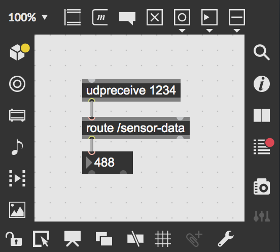
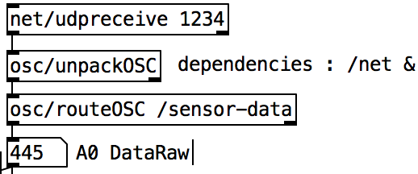

# MaxMSP Interfacing Processing (OSC)


```Java
import oscP5.*;
import netP5.*;

NetAddress remote;
OscP5 oscP5;

void setup(){
  oscP5 = new OscP5(this,12000);
  
  //Addressen som der sendes til. Jeg går ud fra at denne skal bruges i PureData
  remote = new NetAddress("127.0.0.1",1234);
}

void draw(){
  //Navnet på OSC beskeden
  OscMessage msg = new OscMessage("/sensor-data");
  
  //Til denne sketch sender jeg et tilfældigt tal mellem 300 og 500 for at imitere plantesensoren.
  msg.add(floor(random(300, 500)));
  oscP5.send(msg,remote);
}
```

## Max/MSP



<details>
  <summary>Max/MSP patcher</summary>
<pre><code>
----------begin_max5_patcher----------
356.3ocqSEsaCBCC7Y3qHJOS6HzRYa+JSUUAvpKUPBJIzwTU+2WhCnttt0gl
1KX4KG97YmbJNhVpF.Ck7L4ERTzo3nHDxCDMlGQa4CUMbCRiJ6aKAMMIbTG2
V8pPtemFprgxjUrdYZBIKM2GxSwjrkojsi+iqBBYCXw5wt.p5sSnYinhZTSU
4gEEWjTyaAKn2ARdYC3YjNdVnD126fPuPoIDZIWtmR15YbNN1+IYtdEdyI8j
vVX.sHU6jAHOX.oQoWTys7eebvJXXHcy8mGYycdjSumm+W8aecmyOf3HPXYq
VOCytBCOU7W18ra8J6m85U9Dkg1Hje8JM1pd7qMuQ0qqlJ03PkboYqAiUH4V
gR9INEANe63ct5vlgN42nSvd7ttif1LRFkvsEOnz9zGSvTgLjhyRpFNJl3yB
Pbsa0Yc6sdM1WzgMg8JsUUCZYu.IG6cmSS7Jhz8ryzwCFAuIEeN9CbTi.PN
-----------end_max5_patcher-----------
</code></pre>

## Pure Data

Pure Data dependencies; /net & /osc



## Compose

Used in the project [PlantVoiceBox](https://github.com/L4COUR/PlantVoiceBox) where the initially used serial via arduino could not be used, due to a processing sketch using the serial data. apparently serial data cannot be used by two instances at the same time. Therefor where the serial data substituted with an OSC connection. however the sonic expression should still be the same with some adjustment of datasmoothing interpolation. 

